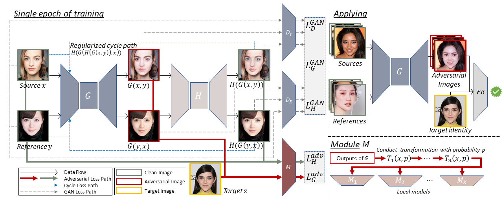

# AMT-GAN

The official implementation of our CVPR 2022 paper "**Protecting Facial Privacy: Generating Adversarial Identity Masks via Style-robust Makeup Transfer**".[[Paper](https://arxiv.org/abs/2203.03121)] 


## Abstract
While deep face recognition (FR) systems have shown amazing performance in identification and verification, they also arouse privacy concerns for their excessive surveillance on users, especially for public face images widely spread on social networks. Recently, some studies adopt adversarial examples to protect photos from being identified by unauthorized face recognition systems. However, existing methods of generating adversarial face images suffer from many limitations, such as awkward visual, white-box setting, weak transferability, making them difficult to be applied to protect face privacy in reality.\
In this paper, we propose adversarial makeup transfer GAN (AMT-GAN), a novel face protection method aiming at constructing adversarial face images that preserve stronger black-box transferability and better visual quality simultaneously. AMT-GAN leverages generative adversarial networks (GAN) to synthesize adversarial face images with makeup transferred from reference images. In particular, we introduce a  new regularization module along with a joint training strategy to reconcile the conflicts between the adversarial noises and the cycle consistence loss in makeup transfer, achieving a desirable balance between the attack strength and visual changes. Extensive experiments verify that compared with state of the arts, AMT-GAN can not only preserve a comfortable visual quality, but also achieve a higher attack success rate over commercial FR APIs, including Face++, Aliyun, and Microsoft.



## Latest Update
**2022/4/15**   We have released the official implementation code. README in developing.

## Setup
- **Get code**
```shell 
git clone https://github.com/CGCL-codes/AMT-GAN.git
```

- **Build environment**
```shell
cd AMT-GAN
# use anaconda to build environment 
conda create -n AMT-GAN python=3.8
conda activate AMT-GAN
# install packages
pip install -r requirements.txt
```

- **Download assets**
  - Pretrained face recognition models and datasets are needed to train and test AMT-GAN, please download these assets at:\
    [[Google](https://drive.google.com/file/d/1Vuek5-YTZlYGoeoqyM5DlvnaXMeii4O8/view?usp=sharing)] [[Baidu](https://pan.baidu.com/s/1dsBYIqp22o_k_RrL_0vmWQ)] pw:9xg6
  - Unzip the assets.zip file in the root path.
  - The final project should be like this:
    ```shell
    AMT-GAN
    └- assets
       └- datasets
       └- models
    └- backbone
    └- checkpoints
    └- ...
    ```

## Acknowledge

Some of the codes are built upon [PSGAN](https://github.com/wtjiang98/PSGAN), pretrained face recognition models are from [Adv-Makeup](https://github.com/TencentYoutuResearch/Adv-Makeup).

## BibTeX 
```bibtex
@article{hu2022protecting,
  title =   {Protecting Facial Privacy: Generating Adversarial Identity Masks via Style-robust Makeup Transfer},
  author =  {Hu, Shengshan and Liu, Xiaogeng and Zhang, Yechao and Li, Minghui and Zhang, Leo Yu and Jin, Hai and Wu, Libing},
  journal = {arXiv preprint arXiv:2203.03121},
  year =    {2022}
}
```
